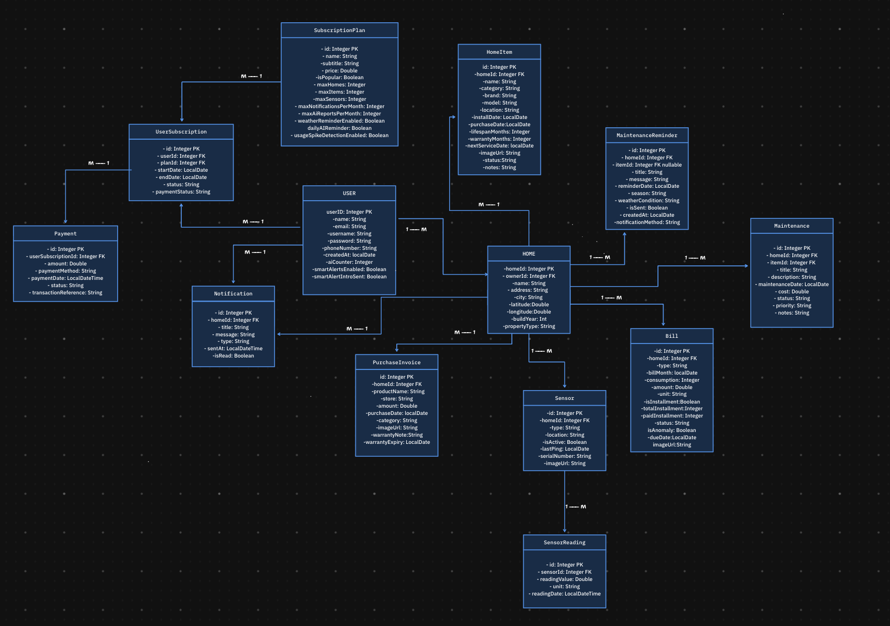

<div align="center">

# 🏠 DAR – Smart Home Care System

### دار – نظام ذكي للعناية بالمنزل

<table>
  <tr>
    <td align="center" bgcolor="#E8DED2">
      <br>
      <b>Smart home-care platform that helps users organize homes, manage maintenance tasks, track invoices and bills, receive intelligent reminders, and get AI-powered home-care insights.</b>
      <br><br>
      <b>منصة ذكية تساعد المستخدمين على تنظيم منازلهم، متابعة أعمال الصيانة، حفظ الفواتير والضمانات، استقبال التذكيرات الذكية، والحصول على توصيات مدعومة بالذكاء الاصطناعي للعناية بالمنزل.</b>
      <br><br>
    </td>
  </tr>
</table>

<br>


</div>

---

## 🌿 Project Overview | نظرة عامة على المشروع

<table>
  <tr>
    <td bgcolor="#E8DED2">
      <b>DAR</b> is a smart home-care system designed to help users manage and organize home maintenance in one place.
      <br><br>
      The platform supports homes, home items, maintenance tasks, reminders, bills, invoices, sensors, notifications, subscriptions, payments, and AI-powered smart recommendations.
      <br><br>
      <b>دار</b> هو نظام ذكي للعناية بالمنزل يساعد المستخدم على تنظيم منزله، متابعة الصيانة، إدارة الفواتير والضمانات، واستقبال التذكيرات الذكية في مكان واحد.
    </td>
  </tr>
</table>

---

## 🎯 Project Goal

DAR aims to solve common home-care problems such as forgotten maintenance tasks, missing invoices and warranties, difficulty tracking bills, and lack of proactive smart reminders.

The system helps users:

* Organize home devices and items.
* Track maintenance history.
* Receive reminders through email, WhatsApp, and urgent calls.
* Monitor bills and invoices.
* Use AI-powered recommendations.
* Get smart alerts based on weather and sensor behavior.

---

## 🧭 Use Case Diagram


---

## 🗂️ ER Diagram

<table>
  <tr>
    <td bgcolor="#E8DED2">
      The ER Diagram represents the main database entities and relationships in the DAR platform, including users, homes, home items, maintenance records, reminders, bills, sensors, subscriptions, payments, and notifications.
    </td>
  </tr>
</table>

<br>



---

## 🔐 Authentication & Security

<table>
  <tr>
    <td bgcolor="#E8DED2">
      The system uses <b>JWT authentication</b> to protect user data and secure private endpoints.
    </td>
  </tr>
</table>

```http
Authorization: Bearer <token>
```

### Security Features

<table>
  <tr>
    <td>✅ JWT-Based Authentication</td>
    <td>✅ Stateless Session Management</td>
  </tr>
  <tr>
    <td>✅ Role-Based Access Control</td>
    <td>✅ Ownership Validation</td>
  </tr>
  <tr>
    <td>✅ Protected APIs</td>
    <td>✅ Secure User Resources</td>
  </tr>
</table>

---

## 🌐 Deployment

<table>
  <tr>
    <td bgcolor="#E8DED2">
      The backend is deployed on <b>AWS Elastic Beanstalk</b> with a production MySQL database hosted on <b>AWS RDS</b>.
    </td>
  </tr>
</table>

### Base URL

```http
http://Dar-env.eba-yke92rm3.eu-central-1.elasticbeanstalk.com
```

---

## 📬 Postman Collection

### Base URL

```http
https://documenter.getpostman.com/view/37607702/2sBXwwnSzc
```


The project APIs are documented and tested using Postman.

The collection includes:

* Authentication
* User management
* Homes
* Home items
* Maintenance
* Maintenance reminders
* Notifications
* Bills
* Purchase invoices
* Sensors
* Subscriptions
* Payments
* Chatbot

---

## 🧰 Tech Stack

<table>
  <tr bgcolor="#765345">
    <th><font color="white">Category</font></th>
    <th><font color="white">Technologies</font></th>
  </tr>
  <tr>
    <td><b>Backend</b></td>
    <td>Java 17, Spring Boot</td>
  </tr>
  <tr bgcolor="#E8DED2">
    <td><b>Security</b></td>
    <td>Spring Security, JWT Authentication</td>
  </tr>
  <tr>
    <td><b>Database</b></td>
    <td>MySQL, Spring Data JPA</td>
  </tr>
  <tr bgcolor="#E8DED2">
    <td><b>Deployment</b></td>
    <td>AWS Elastic Beanstalk, AWS RDS</td>
  </tr>
  <tr>
    <td><b>AI & Automation</b></td>
    <td>OpenAI API, Weather API, n8n Webhooks</td>
  </tr>
  <tr bgcolor="#E8DED2">
    <td><b>Notifications</b></td>
    <td>Twilio API, Java Mail Sender</td>
  </tr>
  <tr>
    <td><b>Testing & Documentation</b></td>
    <td>Postman</td>
  </tr>
</table>

---

## 👩‍💻 My Implemented Endpoints

This section highlights the API endpoints I worked on as part of my contribution to the DAR platform.
My work focused mainly on homes, home items, user profile flow, subscriptions, payments, location lookup, and AI-powered home item support.

### Home Endpoints

| Method | Endpoint | Description | Access |
|---|---|---|---|
| `GET` | `/api/v1/home/user-homes` | Returns all homes owned by the current authenticated user. | Authenticated |

### Home Item Endpoints

| Method | Endpoint | Description | Access |
|---|---|---|---|
| `GET` | `/api/v1/home-item/get/home/{homeId}/category/{category}` | Returns home items filtered by category. | Owner / Admin |
| `GET` | `/api/v1/home-item/get/home/{homeId}/status/{status}` | Returns home items filtered by status. | Owner / Admin |
| `GET` | `/api/v1/home-item/get/home/{homeId}/upcoming-service` | Returns items with upcoming service dates. | Owner / Admin |
| `GET` | `/api/v1/home-item/get/home/{homeId}/search` | Searches home items by keyword. | Owner / Admin |
| `GET` | `/api/v1/home-item/get/home/{homeId}/summary` | Returns a summary of home item statuses. | Owner / Admin |
| `GET` | `/api/v1/home-item/get/{itemId}/nearby-maintenance` | Finds nearby maintenance places for a selected item. | Owner / Admin |
| `GET` | `/api/v1/home-item/get/{itemId}/ai-maintenance-advice` | Generates AI maintenance advice for a selected item. | Owner / Admin |
| `POST` | `/api/v1/home-item/get/{itemId}/ai-troubleshooting` | Generates AI troubleshooting steps based on the user's issue description. | Owner / Admin |
| `GET` | `/api/v1/home-item/get/{itemId}/ai-nearby-recommendation` | Generates an AI recommendation for the best nearby maintenance option. | Owner / Admin |

### User Endpoints

| Method | Endpoint | Description | Access |
|---|---|---|---|
| `PUT` | `/api/v1/user/update-profile` | Updates the current authenticated user's profile. | Authenticated |
| `DELETE` | `/api/v1/user/delete-account` | Deletes the current authenticated user's account. | Authenticated |
| `GET` | `/api/v1/user/profile` | Returns the current authenticated user's profile. | Authenticated |
| `GET`  | `/api/v1/user/email/{email}`       | Finds a user by email.                                 | Admin         |
| `GET`  | `/api/v1/user/username/{username}` | Finds a user by username.                              | Admin         |
| `PUT`  | `/api/v1/user/toggle-smart-alerts` | Enables or disables smart alerts for the current user. | Authenticated |

### User Subscription Endpoints

| Method | Endpoint | Description | Access |
|---|---|---|---|
| `POST` | `/api/v1/user-subscription/subscribe/{planId}` | Creates a pending subscription for the selected plan. | Authenticated |
| `POST` | `/api/v1/user-subscription/upgrade/{planId}` | Creates a pending upgraded subscription for the selected plan. | Authenticated |
| `GET` | `/api/v1/user-subscription/user-subscriptions` | Returns subscriptions for the current authenticated user. | Authenticated |

### Payment Endpoints

| Method | Endpoint | Description | Access |
|---|---|---|---|
| `GET` | `/api/v1/payment/user-payments` | Returns payments for the current authenticated user. | Authenticated |

### 💡 Bills 

| Method | Endpoint | Description | Authorization |
|--------|----------|-------------|---------------|
| `GET`    | `/electricity/{homeId}` | Current month electricity usage | ADMIN or home owner |
| `GET`    | `/water/{homeId}` | Current month water usage | ADMIN or home owner |
| `GET`    | `/gas/{homeId}` | Current month gas usage | ADMIN or home owner |

### Location Endpoints

| Method | Endpoint | Description | Access |
|---|---|---|---|
| `GET` | `/api/v1/location/geocode` | Converts a written address into latitude and longitude using Nominatim. | Public / Authenticated depending on security config |

---

## 🔌 External APIs & Integrations

DAR uses external services to support smart features, automation, notifications, and payments.

<table>
  <tr bgcolor="#765345">
    <th><font color="white">Service</font></th>
    <th><font color="white">Purpose</font></th>
  </tr>
  <tr>
    <td><b>OpenAI API</b></td>
    <td>AI maintenance advice</td>
  </tr>
  <tr bgcolor="#E8DED2">
    <td><b>Twilio WhatsApp & Voice</b></td>
    <td>WhatsApp reminders and urgent calls</td>
  </tr>
  <tr>
    <td><b>Gmail SMTP</b></td>
    <td>Email reminders and notifications</td>
  </tr>
  <tr bgcolor="#E8DED2">
    <td><b>Lemon Squeezy</b></td>
    <td>Subscription checkout and payment links</td>
  </tr>
  <tr>
    <td><b>Overpass API</b></td>
    <td>Nearby maintenance places</td>
  </tr>
  <tr bgcolor="#E8DED2">
    <td><b>Nominatim API</b></td>
    <td>Address geocoding</td>
  </tr>
  <tr>
    <td><b>AWS Elastic Beanstalk</b></td>
    <td>Backend deployment</td>
  </tr>
  <tr bgcolor="#E8DED2">
    <td><b>AWS RDS MySQL</b></td>
    <td>Production database</td>
  </tr>
</table>

<br>

<table>
  <tr>
    <td bgcolor="#F7F2EC">
      API keys and secrets are stored in environment variables, not inside the source code.
    </td>
  </tr>
</table>

---

## 🤖 AI Features

<table>
  <tr>
    <td bgcolor="#E8DED2">
      DAR includes AI features to make home maintenance smarter and more proactive.
    </td>
  </tr>
</table>

<br>

<table>
  <tr>
    <td>🛠️ AI maintenance advice for home items.</td>
  </tr>
  <tr bgcolor="#E8DED2">
    <td>🔍 AI troubleshooting steps for item issues.</td>
  </tr>
  <tr>
    <td>📍 AI nearby maintenance recommendation.</td>
  </tr>
</table>


---

<div align="center">

<table>
  <tr>
    <td align="center" bgcolor="#E8DED2">
      <br>
      <b>DAR makes home care easier, smarter, and more organized.</b>
      <br><br>
    </td>
  </tr>
</table>

</div>
